## 功能介绍 
 

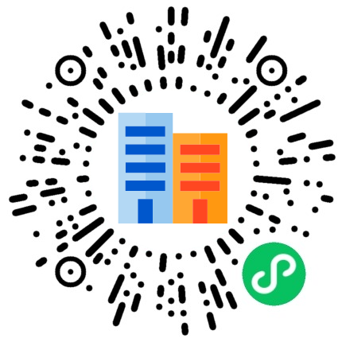

 居民小区小程序：为居民小区打造的轻量化社区服务平台，旨在提升居民生活体验、优化社区管理效率，实现线上线下服务闭环。它既为居民提供便捷的信息获取、社区活动报名、个人中心管理等功能，也为社区管理员提供高效的内容维护、活动管理、用户管理及数据导出等后台能力。对居民：信息获取更及时，社区参与更便捷，生活服务更贴心。对社区：管理效率更高效，数据统计更精准，社区氛围更和谐。

## 技术运用
- 前端基于微信小程序平台进行开发
- 后端基于Java Springboot架构开发
- 数据库： MySQL (8.0+) 

## 演示 
 

## 安装

- 安装手册见源码包里的word文档 

## 截图

 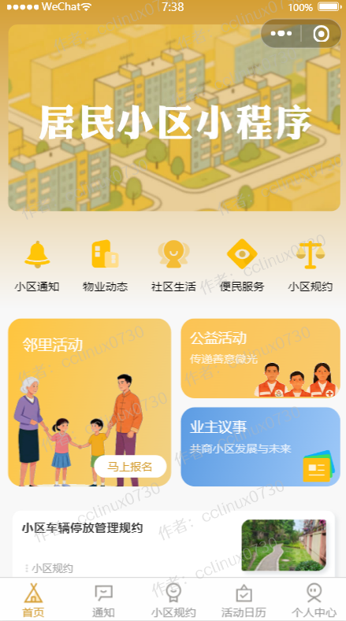

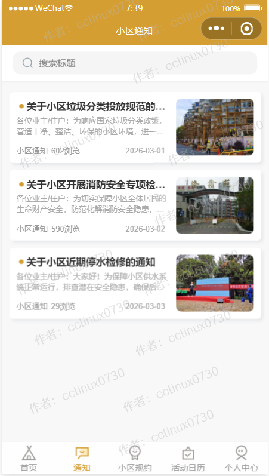

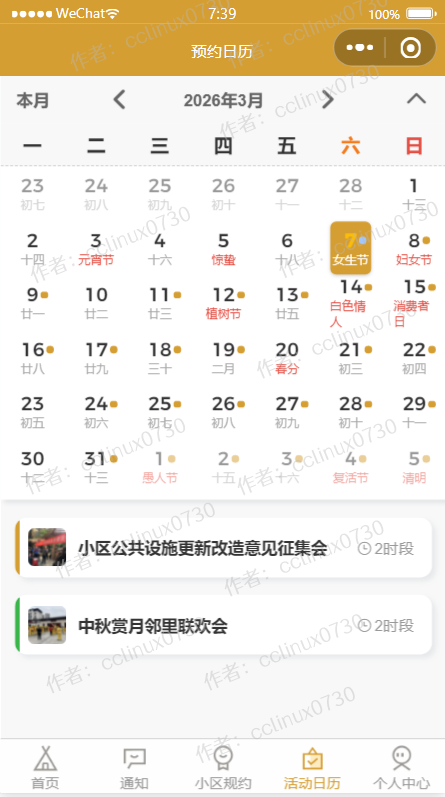

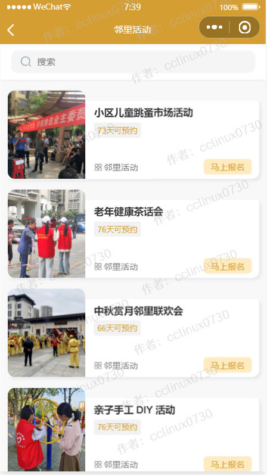
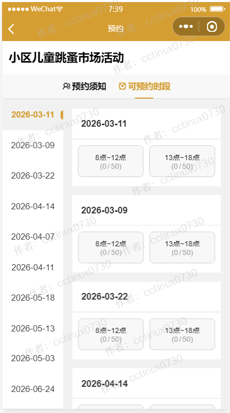
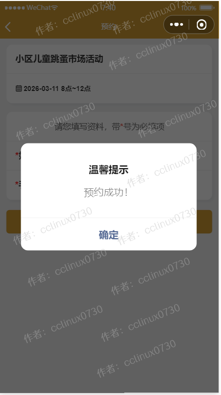
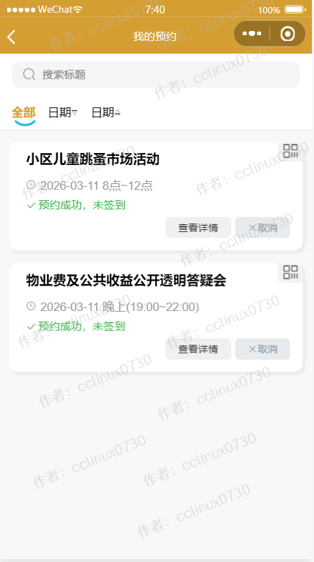

## 后台管理系统截图 
- 后台超级管理员默认账号:admin，密码123456，请登录后台后及时修改密码和创建普通管理员。

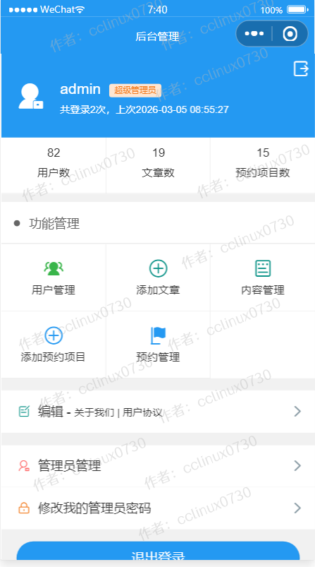

 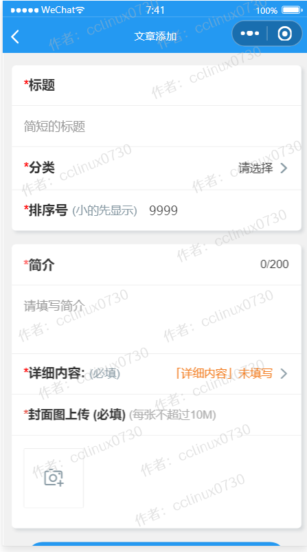

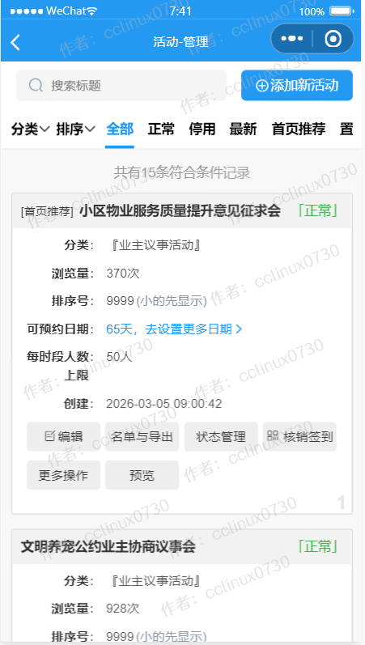

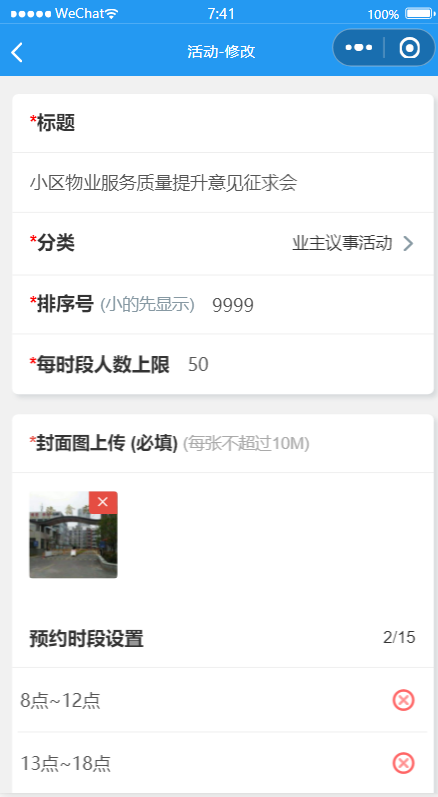
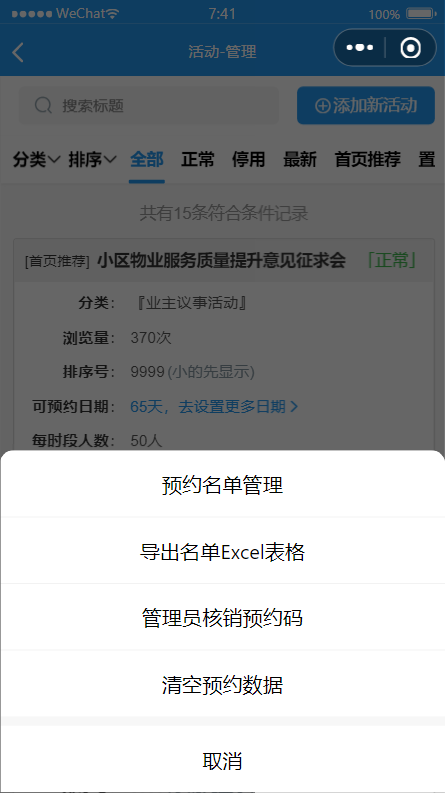

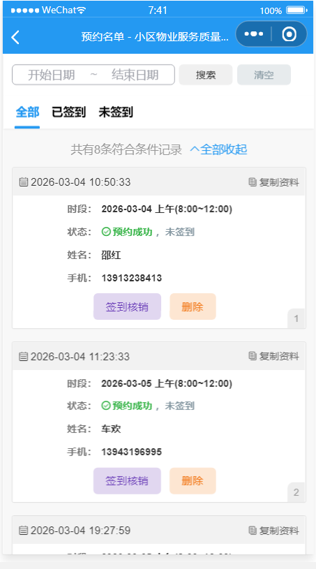

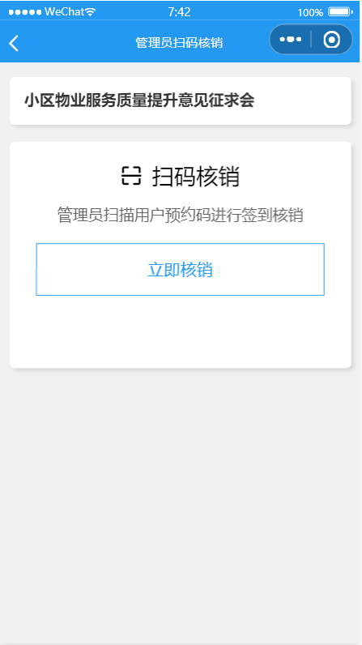

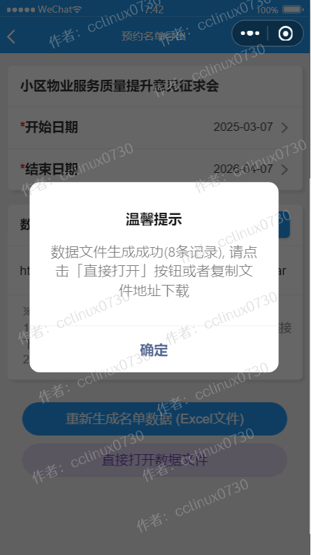
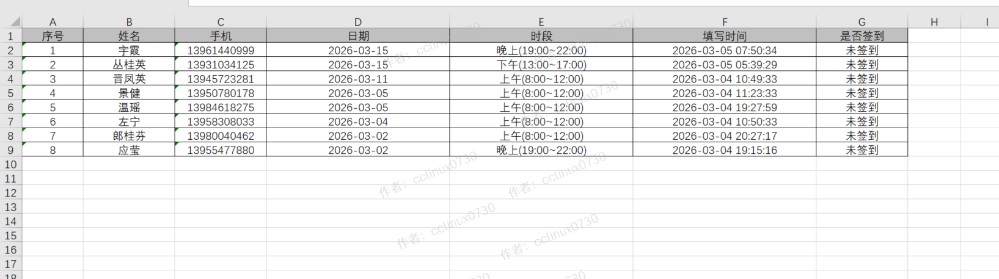